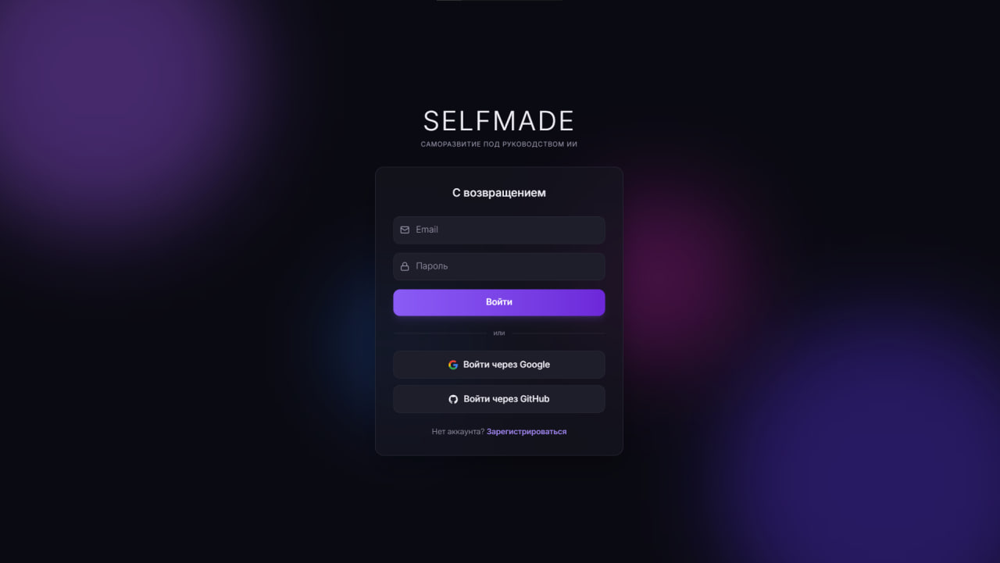
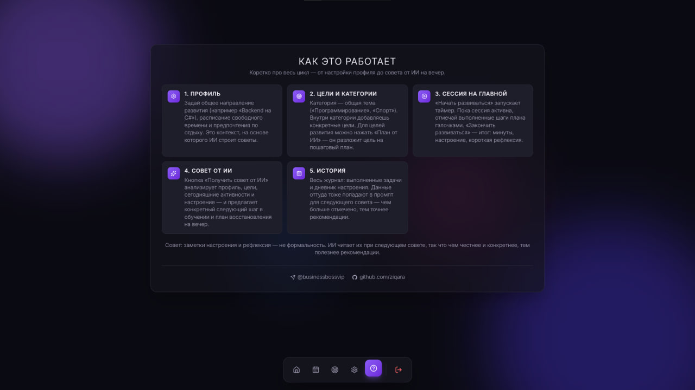
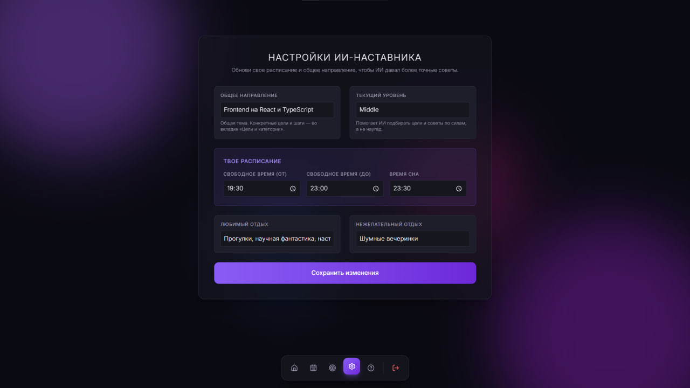
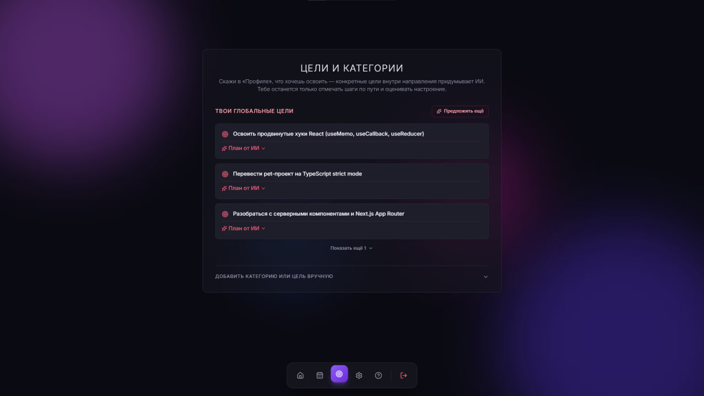
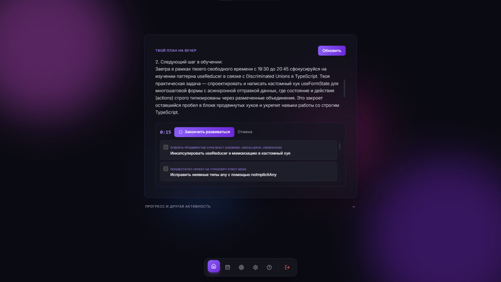
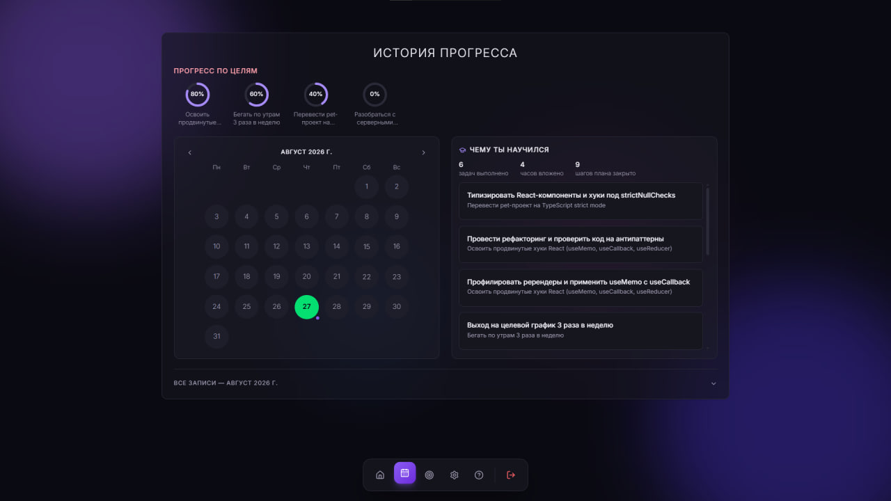

# SELFMADE

Личный ИИ-наставник по саморазвитию: пользователь один раз задает общее направление ("Backend на C#", "Английский язык"), а дальше приложение само раскладывает его на конкретные цели, ведет ежедневную сессию развития, следит за балансом работы и отдыха и дает предметные советы на основе Google Gemini.

Направление развития может быть любым, но по формату промптов и структуре целей приложение лучше всего подходит именно для **изучения языков программирования** — конкретных тем, паттернов и практических задач по конкретному стеку.

## Идея

Классический трекер задач требует, чтобы пользователь сам придумывал, что и когда делать. SelfMade построен вокруг обратного принципа — думать должен ИИ, а не человек:

- Пользователь задает в профиле только вектор развития и расписание свободного времени.
- ИИ сам предлагает конкретные цели внутри этого направления и раскладывает каждую на пошаговый план.
- В течение дня пользователь одной кнопкой открывает "сессию развития", отмечает выполненные шаги и в конце оценивает настроение — это единственное ручное действие.
- На основе профиля, целей, сегодняшней активности и настроения ИИ выдает конкретный следующий шаг в обучении и план восстановления на вечер, учитывая часы отдыха и нежелательные форматы отдыха пользователя.
- История хранится как календарь: цвет дня отражает настроение, отметка — была ли активность; отдельно виден прогресс по каждой цели и сводка того, чему пользователь научился.

## Технологический стек

**Backend**
- ASP.NET Core Web API (.NET 10)
- Entity Framework Core + Npgsql (PostgreSQL)
- JWT Bearer аутентификация, BCrypt для хранения паролей
- Google Gemini API (прямые HTTP-запросы, без SDK)

**Frontend**
- React 19 + TypeScript + Vite
- Tailwind CSS v4 (CSS-first конфигурация через `@theme`)
- Zustand для состояния, react-router-dom для навигации
- motion для анимаций, lucide-react для иконок

**База данных**
- PostgreSQL. Миграций EF Core в репозитории нет — схема поднимается из готового снимка `selfmade-api/schema.sql` (см. раздел "База данных" ниже).

## Структура репозитория

```
selfmade-api/                backend, ASP.NET Core Web API
  Domain/                    доменные сущности (User, Category, UserInterest, ActivityLog, ...)
  Application/Interfaces/    интерфейсы репозиториев и сервисов
  Infrastructure/            EF Core DbContext, реализации репозиториев, интеграция с Gemini
  Presentation/Controllers/  REST-контроллеры

selfmade-client/            frontend, React + TypeScript + Vite
  src/pages/                 страницы (Dashboard, Goals, History, Profile, Auth, Help, ...)
  src/components/            переиспользуемые компоненты (сессия дня, календарь истории, ...)
  src/store/                 Zustand-хранилища (auth, toasts)
  src/api/                   HTTP-клиент и обработка ошибок API
```

## Основные возможности

- Регистрация и вход по email/паролю с JWT-аутентификацией, а также вход через Google и GitHub.
- Профиль пользователя: направление развития, текущий уровень, расписание свободного времени, предпочтения по отдыху.
- Автоматический подбор целей ИИ по направлению из профиля, с созданием категорий и без дублей.
- Пошаговые планы от ИИ для каждой цели развития, с возможностью пересоздать план и отметить прогресс по шагам.
- Единая дневная сессия: старт/финиш вместо таймера на каждую задачу, с чек-листом шагов плана и мягким напоминанием сделать паузу.
- Ежедневная оценка настроения с короткой рефлексией.
- Персональный ИИ-совет: анализ профиля, целей, активности и настроения за день, конкретная рекомендация по следующему шагу в обучении и по формату отдыха.
- История в виде календаря с индикацией настроения и активности по дням, кольца прогресса по каждой цели и сводка выполненных шагов.
- Категории и цели персональные для каждого пользователя, с проверкой владения на уровне API.

## Быстрый старт

### Требования

- .NET SDK 10
- Node.js 20+
- PostgreSQL 15+
- API-ключ Google Gemini

### Backend

```bash
cd selfmade-api
cp appsettings.example.json appsettings.json
```

Заполните `appsettings.json`: строку подключения к вашей базе, произвольный секрет для `Jwt:Key` (не короче 32 символов) и `Gemini:ApiKey`.

Создайте пустую базу данных и накатите схему из `schema.sql`:

```bash
createdb selfmade
psql -U postgres -d selfmade -f schema.sql
```

```bash
dotnet run
```

API поднимется на порту, указанном в `Properties/launchSettings.json` (по умолчанию `http://localhost:5221`).

Запускайте через профиль **http** (в Visual Studio — выбрать его в выпадающем списке рядом с ▶, при `dotnet run` он используется по умолчанию, так как идет первым в `launchSettings.json`). Профиль **https** тоже рабочий, но в коде включен `UseHttpsRedirection`, и без доверенного dev-сертификата браузер будет обрывать запросы с ошибкой сертификата — если он все же нужен, один раз выполните `dotnet dev-certs https --trust`.

#### Вход через Google / GitHub (опционально)

Без этого шага email/пароль все равно работают, просто кнопки "Войти через Google/GitHub" будут показывать ошибку "не настроено на сервере".

**Google**: [Google Cloud Console](https://console.cloud.google.com/) → создать OAuth client ID типа "Web application" → в Authorized redirect URIs добавить `http://localhost:5221/api/auth/google/callback` → скопировать Client ID и Client Secret в `Authentication:Google` в `appsettings.json`.

**GitHub**: [GitHub Developer settings → OAuth Apps](https://github.com/settings/developers) → New OAuth App → Authorization callback URL: `http://localhost:5221/api/auth/github/callback` → скопировать Client ID и сгенерированный Client Secret в `Authentication:GitHub`.

Callback URL должен совпадать с адресом, на котором реально работает backend (порт из `launchSettings.json`), иначе провайдер откажет в редиректе.

### Frontend

```bash
cd selfmade-client
cp .env.example .env
npm install
npm run dev
```

По умолчанию `VITE_API_BASE_URL` указывает на `http://localhost:5221` — поменяйте при необходимости в `.env`.

### Переменные окружения backend (`appsettings.json`)

| Ключ | Назначение |
| --- | --- |
| `ConnectionStrings:DefaultConnection` | строка подключения к PostgreSQL |
| `Jwt:Key` / `Jwt:Issuer` / `Jwt:Audience` | параметры выпуска и валидации JWT |
| `Gemini:ApiKey` | ключ Google Gemini API |
| `Gemini:Model` | используемая модель (по умолчанию `gemini-3.6-flash`) |
| `Cors:AllowedOrigins` | список источников, которым разрешены запросы к API |
| `Authentication:Google:ClientId` / `ClientSecret` | OAuth-клиент Google для входа (см. ниже) |
| `Authentication:GitHub:ClientId` / `ClientSecret` | OAuth-клиент GitHub для входа (см. ниже) |
| `App:FrontendBaseUrl` | куда редиректить браузер после OAuth-входа (по умолчанию `http://localhost:5173`) |

## База данных

Миграций EF Core в репозитории нет: `selfmade-api/schema.sql` — снимок реальной схемы Postgres (7 таблиц, снятый через `pg_dump`, вручную приведен в порядок), а `AppDbContext` описывает маппинг на нее (snake_case-колонки через Fluent API). Файл проверен: применяется на пустую базу без ошибок и создает ровно те таблицы, с которыми работает код.

При изменении домена схему нужно обновить в базе, синхронизировать маппинг в `AppDbContext.cs` и обновить `schema.sql` — единого источника правды для этого в проекте пока нет.

## Диагностика типичных проблем запуска

**Регистрация/вход падают с общей ошибкой "Произошла ошибка. Попробуйте еще раз."**
Это необработанное исключение на бэкенде, а не ошибка валидации формы. Смотрите терминал/вывод `dotnet run` в момент запроса — там будет точный текст исключения. Чаще всего это:
- `Npgsql... Failed to connect to 127.0.0.1:5432` / `SocketException: подключение отвергнуто` — backend стучится не в тот порт. Откройте pgAdmin → правой кнопкой по серверу → Properties → вкладка Connection — там реальный порт вашего Postgres (не обязательно 5432), впишите его в `ConnectionStrings:DefaultConnection`. Проверьте заодно, что служба Postgres вообще запущена.
- `password authentication failed` — пароль в строке подключения не совпадает с реальным паролем пользователя `postgres`.

**В браузере видно два запроса логина подряд, второй с ошибкой — `https://localhost:7051/...` после `http://localhost:5221/...`**
Это `UseHttpsRedirection`: backend запущен на профиле **https** и перенаправляет HTTP-запрос фронтенда на HTTPS-версию, а браузер не доверяет самоподписанному dev-сертификату. Либо запустите профиль **http** (см. раздел Backend выше), либо один раз выполните `dotnet dev-certs https --trust`.

**ИИ не отвечает / советы и подбор целей всегда падают с ошибкой**
Проверьте, что в `Gemini:ApiKey` — именно ключ (строка вида `AQ....`), а не placeholder `your-google-gemini-api-key` и не URL. Поле `Gemini:BaseUrl` — это адрес API (`https://generativelanguage.googleapis.com/v1beta/models`), его легко перепутать местами с `ApiKey` при копировании — эти два поля не взаимозаменяемы. Также помните про дневной лимит бесплатного тарифа Gemini (обычно 20 запросов/день) — если советы работали и внезапно перестали без изменений в коде, скорее всего просто исчерпана квота на сегодня.

## Разработка

- `dotnet build` — сборка backend.
- `npm run lint` и `npx tsc --noEmit` — проверка кода frontend.
- `npm run build` — production-сборка frontend.

## Скриншоты

**Вход** — email/пароль или через Google/GitHub.



**Как это работает** — краткая справка по всему циклу, с контактами автора внизу.



**Профиль** — направление развития, расписание свободного времени, предпочтения по отдыху: контекст, на основе которого ИИ строит советы и подбирает цели.



**Цели и категории** — глобальные цели по направлению из профиля, для каждой доступен пошаговый план от ИИ.



**Главная / активная сессия** — совет от ИИ на сегодня и чек-лист шагов текущей цели, пока сессия развития идет.



**История** — календарь с индикацией настроения и активности по дням, прогресс по целям и список записей за выбранный месяц.


